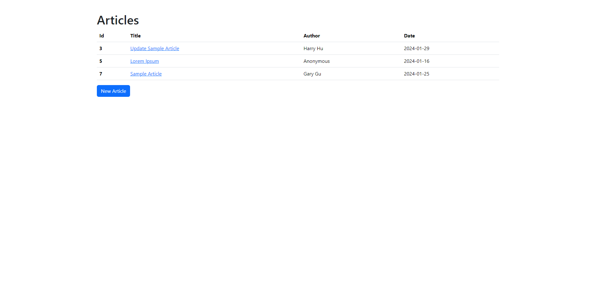
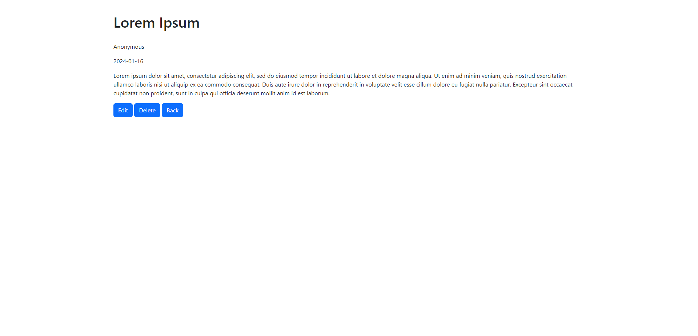
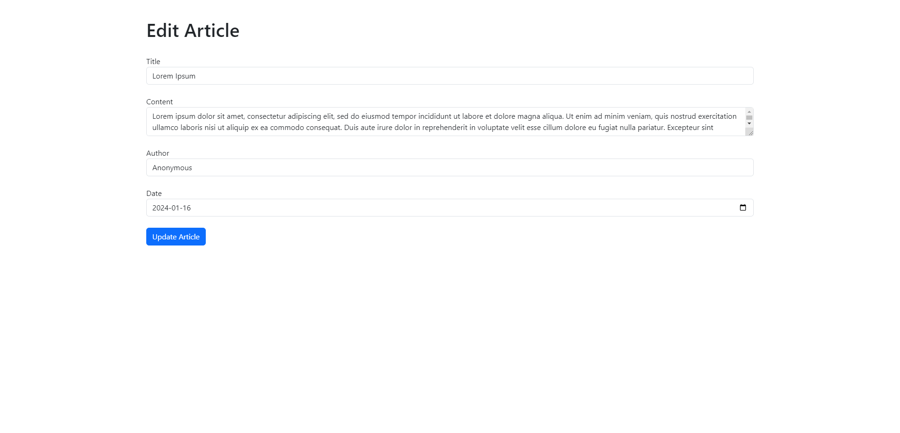

# Project Overview
This Rails application is an Encyclopedia, which allows users to create, view, edit, and delete articles. The application also provides search functionality to help users find relevant articles. These features were implemented as part of the internship assignment.

# Project Goals (Taken From the Assignment)

1. Review Existing Tests: Start by reviewing the existing tests provided in the article_test.rb file located in the test/models directory. Understand the requirements and expectations of each test.

2. Implement Functionality: Write the code necessary to make the existing tests pass. This involves implementing the required actions and logic in the models, controllers, and views to fulfill the specified requirements. Also be sure to implement basic CRUD actions and demonstrate proper MVC principals.

3. Ensure Code Quality: Write clean, well-structured, and maintainable code. Follow best practices and adhere to the Ruby on Rails conventions. Pay attention to code readability, modularity, and performance.

4. Test Your Code: After implementing the functionality, run the tests to ensure that they pass successfully. Fix any failures or errors that occur and retest until all tests pass.

5. Code Documentation: Document your code by adding comments and explanatory notes where necessary. This will help other developers understand your implementation and make future maintenance easier.

6. Version Control: Use Git for version control. Commit your changes regularly and push them to a branch in your forked repository.

7. Create a Pull Request: Once you have completed the project goals, create a pull request to merge your changes into the main repository. Provide a clear description of the changes made and any relevant information for the code review.

# Additional Changes Made
- Added validations for the presence of the "title" and "content" fields of the Article model 
- Added error messages when the required fields are missing when creating or updating an Article.
- Added two additional tests to `article_test.rb` to ensure that creating or updating an Article is not successful if a required field is missing. 
- Added tests in `articles_controllers_test.rb` to verify that all functions in `articles_controllers.rb` behave as expected.
- Used Bootstrap to clean up the look of the overall app (see below screenshots).

# Screenshots

# Getting Started
To run the app locally:
1. Clone the repository to your local development environment.
2. Run `bundle install` in the project directory to install the necessary dependencies.
3. Run `bin/rails db:migrate` to create the database.
4. Run `bin/rails test` to run all tests.
5. Run `bin/rails s` and visit http://localhost:3000/.

